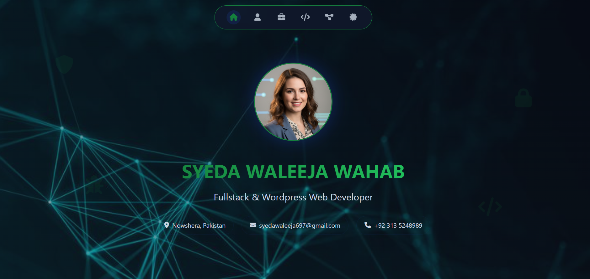
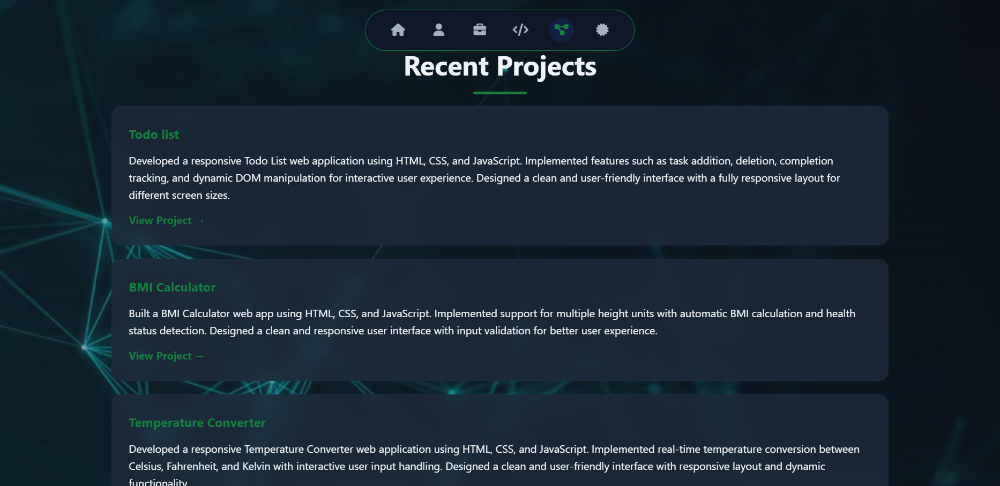
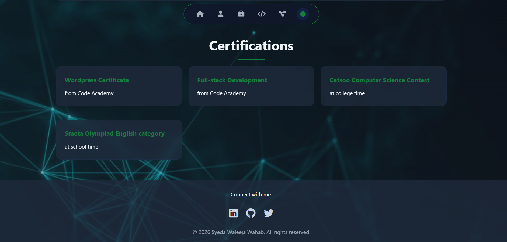

# 💫 Syeda Waleeja Wahab - Portfolio

A modern, responsive personal portfolio website built using HTML, CSS, and JavaScript.

---

## 🌐 Project Preview

This portfolio is a personal website that showcases my skills, projects, and web development journey with a clean and responsive design.

---

## 🛠️ Technologies Used

- HTML5  
- CSS3  
- JavaScript  
- Responsive Web Design  
- Git & GitHub  

---

## 🚀 Live Demo

👉 https://syeda-waleeja-wahab.netlify.app/

---

## 📸 Screenshots / Showcase






---

## ⚙️ Setup Instructions (Optional)

```bash
git clone https://github.com/your-username/portfolio.git
```

Then open:

```
index.html
```

in your browser.
